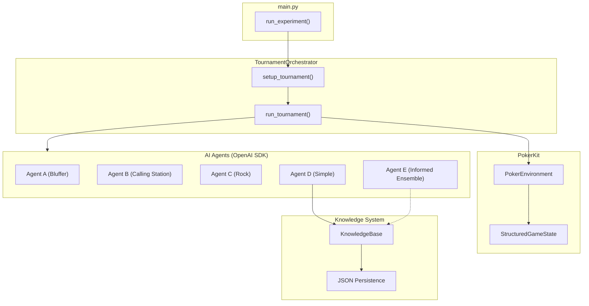

# Poker Bot POC 🃏

AI poker agents using OpenAI Agents SDK to compare **single-agent vs multi-agent ensemble** architectures for poker decision-making.

## Hypothesis

> Given the **same opponent statistics**, does a multi-agent ensemble architecture (GTO Analyst + Exploit Analyst + Decision Maker) make better poker decisions than a single combined agent?

**Experiment Design:**
- **Agent D**: Single LLM with combined GTO + Exploit reasoning
- **Agent E**: Three specialists (GTO → Exploit → Decision) working together
- **Both start with identical calibrated opponent statistics**

## Quick Start

```bash
# Install dependencies
cd poc-pokerbot
uv sync

# Configure environment
cp env.example .env
# Edit .env with your API key (see env.example for all options)

# Run experiment (5 tournaments)
uv run python -m backend.main -n 5

# Run calibration mode (build opponent profiles)
uv run python -m backend.main --calibrate -n 10

# Verbose mode (debug logging)
uv run python -m backend.main -n 3 -v
```

## Features

- **GTO Deviation Tracking**: Monitors when agents follow vs deviate from GTO, with profit/loss analysis
- **Structured Logging**: All game logs exported to JSON for analysis
- **Tool Usage Tracking**: Records which tools agents use during decisions
- **Showdown Detection**: Accurate WTSD tracking via PokerKit operations

## Documentation

| Document | Description |
|----------|-------------|
| [Architecture](docs/ARCHITECTURE.md) | System design, component diagrams, data flow |
| [Development Notes](docs/DEVELOPMENT_NOTES.md) | Issues encountered and solutions |

## Architecture Overview



## Agents

| Agent | Strategy | Architecture | Shared Knowledge | Tools |
|-------|----------|--------------|------------------|-------|
| Agent A | Aggressive Bluffer | Simple | ❌ No | None |
| Agent B | Passive Calling Station | Simple | ❌ No | None |
| Agent C | Tight Rock | Simple | ❌ No | None |
| **Agent D** | **Balanced Exploiter** | **Simple (1 LLM)** | **✅ Yes** | pot_odds, equity, position |
| **Agent E** | **Informed Ensemble** | **Ensemble (3 LLMs)** | **✅ Yes** | pot_odds, equity, position |

### Architecture Comparison

| Feature | Agent D (Simple) | Agent E (Ensemble) |
|---------|------------------|-------------------|
| LLM Calls per Decision | 1 | 3 (2 parallel + 1 sequential) |
| Reasoning Style | Combined GTO + Exploit | Separated specialists |
| Tools Available | pot_odds, equity, position | pot_odds, equity, position (GTO only) |
| Opponent Stats | Injected to prompt | Injected to prompt |
| Output Fields | GTO_ANALYSIS, EXPLOIT_ANALYSIS, GTO_DEVIATION, ACTION | Same via Decision Maker |
| Decision Transparency | Medium | High (explicit analyst outputs) |
| Latency | ~1-2s | ~3-4s |

### Experiment Design

Both **Agent D** and **Agent E** start with the **same calibrated statistics** on opponents:
- VPIP/PFR (playing style)
- Limp frequency
- C-bet frequencies (flop/turn/river)
- Fold to 3-bet percentages
- Aggression factor
- WTSD/WSD (showdown tendencies)

**The key difference is the decision-making architecture:**

**Agent D (Simple)**: Single LLM call with combined GTO + Exploit reasoning in one prompt.

**Agent E (Ensemble)**: Three specialized agents working together:
1. 🎯 **GTO Analyst** - Pure mathematical/theoretical analysis
2. 🔍 **Exploit Analyst** - Opponent-specific exploitation
3. 🎲 **Decision Maker** - Weighs both to produce final action

## Configuration

### Environment Variables

```bash
# === Core Settings (all endpoints) ===
OPENAI_API_KEY=your-api-key
OPENAI_MODEL=gpt-4o                # Model name (OpenAI) or deployment name (Azure)

# === Option 1: Direct OpenAI (default) ===
# Just set OPENAI_API_KEY and OPENAI_MODEL above

# === Option 2: Azure OpenAI ===
OPENAI_BASE_URL=https://your-resource.openai.azure.com/
ENDPOINT_TYPE=azure                # Required for Azure
AZURE_OPENAI_API_VERSION=2025-03-01-preview  # Optional (default shown)

# === Model Parameters (optional) ===
TEMPERATURE=0.7                    # Generation temperature (default: 0.7)
REASONING_EFFORT=medium            # low, medium, high (for supported models)
```

**Note**: Tracing is automatically disabled for Azure to avoid API key errors.

### CLI Options

```bash
uv run python -m backend.main [OPTIONS]

Options:
  -n, --tournaments INT   Number of tournaments to run (default: 1)
  -c, --calibrate         Run in calibration mode (Agent D learns from scratch)
  -h, --help              Show help message
```

### Tournament Parameters

- Starting stack: 1,500 chips
- Blinds: 10/20 (increase every 15 hands)
- Max hands: 300 per tournament

## Calibration Mode

Calibration mode runs tournaments where Agent D starts with **no pre-loaded knowledge** and learns opponent behaviors through observation.

```bash
# Run 10 calibration tournaments
uv run python -m backend.main --calibrate -n 10
```

Results are saved to `data/knowledge/calibrated_stats.json` and **accumulate** across runs. These become the pre-loaded knowledge for Agent D in normal mode.

## Project Structure

```
poc-pokerbot/
├── backend/
│   ├── main.py                 # CLI runner, results output
│   ├── config.py               # Settings
│   ├── logging_config.py       # Structured logging, LogCollector
│   └── domain/
│       ├── game/               # PokerKit integration
│       │   ├── models.py       # StructuredGameState, Card, etc.
│       │   └── environment.py  # PokerKit wrapper
│       ├── player/             # Player statistics
│       │   ├── models.py       # PlayerProfile, KnowledgeBase
│       │   └── tracker.py      # Statistics tracking (VPIP, PFR, WTSD)
│       ├── agent/              # AI agents
│       │   ├── poker_agent.py  # Simple agent (Agent D)
│       │   ├── ensemble_agent.py # Multi-agent ensemble (Agent E)
│       │   ├── specialists.py  # GTO/Exploit/Decision specialists
│       │   ├── utils.py        # Tool tracking, GTO deviation tracker
│       │   ├── strategies/     # Agent personalities
│       │   └── tools/          # @function_tool tools
│       └── tournament/
│           └── orchestrator.py # Tournament runner, outcome tracking
├── data/
│   ├── knowledge/              # Persistent knowledge storage
│   │   └── calibrated_stats.json  # Shared by D & E
│   └── results/                # Experiment results
│       └── experiment_*.json   # Includes logs + deviation stats
├── docs/
│   ├── ARCHITECTURE.md         # System architecture
│   └── DEVELOPMENT_NOTES.md    # Issues and lessons learned
└── pyproject.toml
```

## How It Works

1. **Tournament starts** with 5 agents, each with 1,500 chips

2. **Each hand**:
   - PokerKit deals cards and manages game state
   - Active agent receives `StructuredGameState` with hand history + opponent stats
   - Agent can use tools: `calculate_pot_odds`, `calculate_equity`, `get_position_info`
   - Agent must provide:
     - `GTO_ANALYSIS`: Pure mathematical reasoning
     - `EXPLOIT_ANALYSIS`: Opponent-specific adjustments  
     - `GTO_DEVIATION`: Why following or deviating from GTO
     - `ACTION`: Final decision with confidence
   - Action executed in environment
   - **Other agents observe** and update their knowledge bases

3. **Both Agent D and E start with same knowledge**:
   - Pre-calibrated opponent statistics (from calibration mode)
   - Same tools and information access
   - **Only difference is architecture** (single vs ensemble)

4. **Tournament ends** when one player has all chips

5. **Knowledge persistence** (after calibration):
   - Accumulated stats saved to `calibrated_stats.json`
   - Both D and E load this file at tournament start

## Statistics Tracked

| Statistic | Description |
|-----------|-------------|
| VPIP | Voluntarily Put $ In Pot (loose vs tight) |
| PFR | Pre-Flop Raise frequency |
| Limp | Calling preflop without raising |
| 3-Bet | Re-raising a preflop raise |
| Fold to 3-Bet | How often player folds to a 3-bet |
| C-Bet | Continuation bet frequency (flop/turn/river) |
| Aggression Factor | (Bets + Raises) / Calls |
| WTSD | Went To ShowDown percentage |
| WSD | Won at ShowDown percentage |

### Sample Size Requirements

| Hands Played | Reliability | Display |
|--------------|-------------|---------|
| < 20 | ⚠️ Very Low | "INSUFFICIENT DATA - Play GTO" |
| 20-49 | ⚠️ Low | Stats shown with warning |
| 50-99 | 📊 Moderate | Stats reliable for cautious exploitation |
| 100+ | ✅ Good | Stats fully reliable |

**Rule**: Never exploit based on < 50 hands - variance is too high!

## Expected Results

After running multiple tournaments:
- Agent D should have a **lower average placement** (closer to 1st)
- Agent D should have a **higher win rate**
- The gap should be **statistically significant** after sufficient tournaments

## Output & Analysis

Results are saved to `data/results/experiment_YYYYMMDD_HHMMSS.json` containing:

### Tournament Results
- Win rates and placement distributions for each agent
- Per-tournament details (hands played, final stacks)

### GTO Deviation Analysis
```
📐 GTO DEVIATION ANALYSIS:
Overall:
  - GTO Decisions: 150
  - Deviation Decisions: 50
  - Deviation Rate: 25.0%
  - GTO Profit/Loss: +1200
  - Deviation Profit/Loss: +800

Agent D (Simple):
  - Decisions: 80 GTO, 30 deviations (27.3% deviation rate)
  - GTO Profit: +600 (avg: +7.5/hand)
  - Deviation Profit: +500 (avg: +16.7/hand)
  ✅ Deviations were PROFITABLE (avg +9.2/hand better)
```

This helps answer: **Are the agents' exploitative deviations actually profitable?**

### Structured Game Logs
Each decision is logged with structured fields:
- `agent_id`, `hand_num`, `action`, `amount`
- `gto_analysis`, `exploit_analysis`, `gto_deviation`
- `is_following_gto` (boolean for easy filtering)
- `tools_used`, `cards`, `board`, `pot`, `stack`, `street`

## Technologies

- **[PokerKit](https://github.com/uoftcprg/pokerkit)** - Poker game simulation and hand evaluation
- **[OpenAI Agents SDK](https://github.com/openai/openai-agents-python)** - AI agent framework with tools
- **[Pydantic](https://docs.pydantic.dev/)** - Data validation and serialization
- **[uv](https://github.com/astral-sh/uv)** - Fast Python package manager
- **Python 3.11+** with async/await

## References

- PokerKit: [github.com/uoftcprg/pokerkit](https://github.com/uoftcprg/pokerkit)
- OpenAI Agents SDK: [github.com/openai/openai-agents-python](https://github.com/openai/openai-agents-python)
- Development Notes: [docs/DEVELOPMENT_NOTES.md](docs/DEVELOPMENT_NOTES.md)
