# PokerAgents Architecture

## System Overview


## Component Details

### 1. Tournament Orchestrator

The central controller that manages the poker tournament lifecycle.


### 2. PokerKit Integration

The `PokerEnvironment` class wraps PokerKit to provide a clean interface.


### 3. AI Agent Architecture

The system supports two agent architectures:

#### 3a. Simple Agent (Agent D)

Single-agent architecture using OpenAI Agents SDK with combined GTO + Exploit reasoning.


**Key Features:**
- Opponent stats and position info **injected directly into prompt**
- Access to pot odds and equity calculation tools
- Must provide **GTO_DEVIATION** explanation for each decision

#### 3b. Multi-Agent Ensemble (Agent E)

Three specialized agents working together for better analysis separation.


**Specialist Responsibilities:**

| Specialist | Focus | Tools | Output |
|------------|-------|-------|--------|
| **GTO Analyst** | Mathematical/theoretical poker | pot_odds, equity | Hand strength, recommended sizing |
| **Exploit Analyst** | Opponent tendencies | None (stats in prompt) | Type classification, leak identification |
| **Decision Maker** | Synthesize both analyses | None | Final action + GTO_DEVIATION reasoning |

**Key Benefits:**
- Parallel execution of GTO and Exploit analysis
- Clean separation of concerns
- More transparent decision making
- Better specialization per domain

**Trade-offs:**
- 3x LLM calls per decision (2 parallelizable + 1 sequential)
- Higher latency (~2x vs single agent)
- More tokens consumed per action

### 3c. Structured Output (ActionDecision)

Both agent architectures use the same `ActionDecision` Pydantic model for structured LLM output.


**Key Features:**
- Used with OpenAI Agents SDK `output_type` for reliable JSON parsing
- Flexible bet sizing (absolute chips, BB multiple, or pot fraction)
- Automatic action validation and fallback to legal actions
- Combined `to_action()` method resolves to executable `Action` object

### 3d. Shared Prompts (Single Source of Truth)

Both agents use shared exploitation guidelines from `prompts.py`:

```python
# prompts.py - Used by both Agent D and Agent E
EXPLOITATION_GUIDELINES = """
Key Principle: More hands observed = More confidence in exploitation

Before deciding to exploit:
1. CHECK THE HAND COUNT
2. Scale confidence with sample size
3. GTO is the safe default
"""

GTO_DEFAULT = """
GTO is Your Default Strategy
Only deviate when you have:
1. Enough observed hands
2. A clear, specific leak
3. Confidence the exploit improves EV
"""
```

**Design Principle:** Simple guidelines let the LLM reason, rather than rigid rules that might be ignored.

### 4. Knowledge Base System

Tracks opponent statistics and enables exploitation.


### 5. Statistics Tracking Flow


### 6. Sample Size Requirements

Statistics require sufficient sample size to be meaningful:

| Hands | Reliability | Display |
|-------|-------------|---------|
| < 20 | ⚠️ Very Low | "INSUFFICIENT DATA - Play GTO" |
| 20-49 | ⚠️ Low | Stats shown with warning |
| 50-99 | 📊 Moderate | Stats reliable for cautious exploitation |
| 100+ | ✅ Good | Stats fully reliable |

**Key Rule**: Never exploit based on < 50 hands - variance is too high!

### 7. Agent Knowledge Persistence

Both Agent D and Agent E are "informed" agents that receive the **same shared knowledge**:


**Knowledge Files:**

| File | Purpose |
|------|---------|
| `calibrated_stats.json` | Accumulated stats from calibration runs (shared by both agents) |
| `agent_d_knowledge.json` | Agent D's learned knowledge (saved per tournament) |
| `agent_e_knowledge.json` | Agent E's learned knowledge (saved per tournament) |

**Experiment Design**: Both agents start with **identical knowledge** from `calibrated_stats.json` - only the architecture differs.

## Data Flow

### Normal Tournament Mode

```mermaid
flowchart LR
    calibrated["calibrated_stats.json"]
    
    calibrated --> |"Same knowledge"| AgentD["Agent D (Simple)"]
    calibrated --> |"Same knowledge"| AgentE["Agent E (Ensemble)"]
    
    AgentD --> |"1 LLM call"| DecisionD["Combined GTO+Exploit"]
    AgentE --> |"3 LLM calls"| DecisionE["GTO → Exploit → Decision"]
```



### Calibration Mode


## Technology Stack

| Component | Technology | Purpose |
|-----------|------------|---------|
| Game Engine | PokerKit | Poker rules, hand evaluation, state management |
| AI Framework | OpenAI Agents SDK | LLM-based decision making with tools |
| LLM | GPT-4o / Azure OpenAI | Agent reasoning and action selection |
| Serialization | Pydantic | Data models and JSON serialization |
| Configuration | Pydantic Settings | Environment variable management |
| Package Manager | uv | Fast Python dependency management |

## Agent Tools

All agents (A, B, C, D, E) are LLM-based and have access to the same toolset:

| Tool | Description |
|------|-------------|
| `calculate_pot_odds(pot, to_call)` | Calculate required equity to call profitably |
| `calculate_equity(hole_cards, board, opponents)` | Monte Carlo hand strength simulation using PokerKit |

**Architecture differences**:
- **Agent D (single LLM)**: Tools available directly to the agent
- **Agent E (ensemble)**: Only the GTOAnalyst specialist has tools; ExploitAnalyst and DecisionMaker receive data via prompts

**Note**: Position info and opponent statistics are injected directly into prompts - no tools needed.

## Tracking & Analysis Systems

### GTO Deviation Tracker

Monitors when agents follow vs deviate from GTO and correlates with profit/loss.


**Tracked per decision:**
- `hand_num`, `action`, `is_following_gto`, `deviation_reason`

**Calculated at end:**
- GTO decisions count & profit
- Deviation decisions count & profit
- Average profit per decision type

### Structured Logging

All game events captured with structured fields for JSON export.


**Structured fields per decision:**
- Core: `agent_id`, `hand_num`, `action`, `amount`, `confidence`
- Analysis: `gto_analysis`, `exploit_analysis`, `gto_deviation`, `is_following_gto`
- Context: `cards`, `board`, `pot`, `stack`, `street`
- Tools: `tools_used[]`

### Tool Usage Tracker

Records which tools agents invoke during decisions.

**Purpose**: Verify agents are using tools appropriately for mathematical analysis.

**Tracked:**
- Tool name, arguments, hand number
- Per-agent summary counts

---

## Related Documentation

- **[EXPERIMENT.md](EXPERIMENT.md)** - Project goals, hypotheses, and challenges
- **[PROJECT_STRUCTURE.md](PROJECT_STRUCTURE.md)** - Team delegation and module responsibilities

