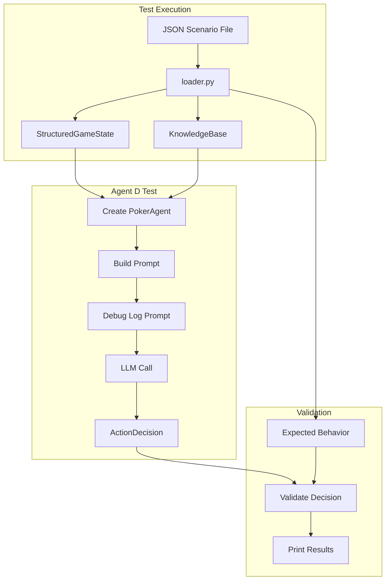

# Agent Scenario Testing Framework

## Goal

Create a testing framework that allows testing poker agents (D and E) in isolation using JSON-defined game scenarios, with debug logging to inspect the prompts being sent to the LLM.

## Directory Structure

```
app/tests/
├── __init__.py
├── conftest.py                      # Shared pytest fixtures
└── agent_scenarios/
    ├── __init__.py
    ├── loader.py                    # JSON to GameState converter
    ├── test_agent_d.py              # Agent D scenario tests
    ├── test_agent_e.py              # Agent E scenario tests
    └── scenarios/
        ├── preflop/
        │   └── premium_aa_utg.json
        ├── flop/
        │   └── top_pair_dry_board.json
        ├── turn/
        └── river/
            └── bluff_catch_vs_aggressor.json
```

## Implementation Tasks

### 1. Add Debug Logging for Agent Prompts

Modify [`app/backend/domain/agent/poker_agent.py`](app/backend/domain/agent/poker_agent.py) to log the full prompt:

```python
async def decide(self, game_state: StructuredGameState) -> ActionDecision:
    prompt = self._build_state_prompt(game_state)
    
    # Debug logging - print full prompt
    logger.debug(f"Agent {self.player_id} prompt:\n{'='*60}\n{prompt}\n{'='*60}")
    
    result = await Runner.run(self._agent, prompt)
    # ...
```

Modify [`app/backend/domain/agent/ensemble_agent.py`](app/backend/domain/agent/ensemble_agent.py) similarly to log all three prompts (state, opponent stats, hand history).

### 2. Create Scenario Loader

Create `app/tests/agent_scenarios/loader.py` with:

- `Scenario` dataclass containing game state, knowledge base, and expected behavior
- `load_scenario(filepath)` - Parse JSON file into Scenario object
- `load_scenarios_from_dir(directory)` - Load all scenarios recursively
- `save_game_state_as_scenario()` - Capture real game states for regression testing

**JSON Schema for scenarios:**

```json
{
  "id": "scenario_id",
  "name": "Human readable name",
  "description": "What this tests",
  "street": "preflop|flop|turn|river",
  "game_state": {
    "hand_number": 1,
    "pot": 100,
    "current_bet": 20,
    "hero_seat": 2,
    "hero_cards": ["As", "Ah"],
    "community_cards": [],
    "players": [...],
    "legal_actions": ["fold", "call", "raise"],
    "action_history": [...]
  },
  "opponent_knowledge": {
    "Agent A": {
      "hands_played": 150,
      "vpip": 42.0,
      "pfr": 35.0,
      "tendencies": ["Bluffs frequently"]
    }
  },
  "expected": {
    "valid_actions": ["raise", "all_in"],
    "invalid_actions": ["fold"],
    "min_confidence": 0.7,
    "notes": "AA should always raise"
  }
}
```

### 3. Create Test Files

**`test_agent_d.py`** - Tests for Agent D (simple architecture):

- Load scenarios from JSON
- Create agent with scenario's knowledge base
- Run `decide()` and print full decision with reasoning
- Validate against expected behavior
- Parametrized test to run all scenarios automatically

**`test_agent_e.py`** - Tests for Agent E (ensemble architecture):

- Same structure as Agent D tests
- Additional comparison tests: run same scenario through both agents

### 4. Create Sample Scenarios

Create 3-4 initial JSON scenarios covering:

- Preflop: Premium hand (AA) - should raise
- Flop: Top pair on dry board - should c-bet
- River: Bluff catch vs known bluffer - tests exploit analysis

## Data Flow



## Running Tests

```bash
# Run with debug logging enabled
cd app
LOG_LEVEL=DEBUG uv run pytest tests/agent_scenarios/ -v -s

# Run specific agent tests
uv run pytest tests/agent_scenarios/test_agent_d.py -v -s

# Run single scenario
uv run pytest tests/agent_scenarios/test_agent_d.py::TestPreflopScenarios::test_premium_aa -v -s
```

## Files to Create

| File | Purpose |

|------|---------|

| `app/tests/__init__.py` | Package init |

| `app/tests/conftest.py` | Shared fixtures (settings) |

| `app/tests/agent_scenarios/__init__.py` | Package init |

| `app/tests/agent_scenarios/loader.py` | JSON to GameState converter |

| `app/tests/agent_scenarios/test_agent_d.py` | Agent D tests |

| `app/tests/agent_scenarios/test_agent_e.py` | Agent E tests |

| `app/tests/agent_scenarios/scenarios/preflop/premium_aa_utg.json` | Sample scenario |

| `app/tests/agent_scenarios/scenarios/river/bluff_catch_vs_aggressor.json` | Sample scenario |

## Files to Modify

| File | Change |

|------|--------|

| [`app/backend/domain/agent/poker_agent.py`](app/backend/domain/agent/poker_agent.py) | Add debug logging for prompt |

| [`app/backend/domain/agent/ensemble_agent.py`](app/backend/domain/agent/ensemble_agent.py) | Add debug logging for all prompts |