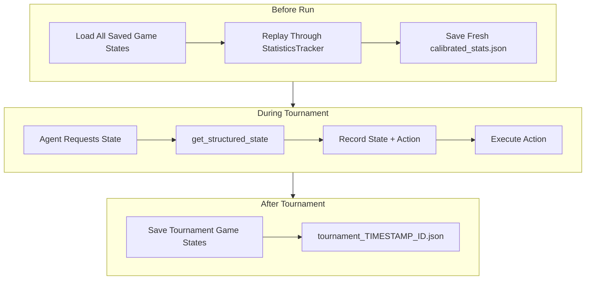

# Game State Persistence and Statistics Recalculation

## Current Architecture

The tournament orchestrator runs hands via `_play_hand()`, which calls `get_structured_state()` for each decision. Statistics are tracked by `StatisticsTracker` during play but only saved per-agent after each tournament. The `calibrated_stats.json` is loaded once at startup and used as baseline knowledge.

## Proposed Changes

### 1. Add Serialization to Game Models

Modify [`backend/domain/game/models.py`](app/backend/domain/game/models.py):

- Add `to_dict()` method to `Card`, `PlayerState`, `StructuredGameState`
- Add `from_dict()` class methods for deserialization
- Include action context in saved states (actor, action taken)

### 2. Create Game State Recorder

Create new module `backend/domain/game/recorder.py`:

- `GameStateRecorder` class to collect states during a tournament
- `save_tournament()` method writes all states to timestamped JSON file
- `load_all_tournaments()` method reads all saved game state files

Saved file structure (`data/gamestates/tournament_YYYYMMDD_HHMMSS_<id>.json`):

```json
{
  "tournament_id": "...",
  "timestamp": "...",
  "states": [
    {"state": {...}, "actor": "agent_a", "action": {"type": "raise", "amount": 100}}
  ]
}
```

### 3. Create Statistics Recalculator

Create new module `backend/domain/player/recalculator.py`:

- `recalculate_baseline_stats()` function
- Loads all saved tournament files
- Replays actions through a fresh `StatisticsTracker`
- Saves fresh `calibrated_stats.json` before tournament run

### 4. Integrate into Tournament Flow

Modify [`backend/domain/tournament/orchestrator.py`](app/backend/domain/tournament/orchestrator.py):

- Add `GameStateRecorder` instance to `TournamentOrchestrator`
- Record each `(state, actor, action)` tuple in `_play_hand()`
- Save recorded states at tournament end in `run_tournament()`

Modify [`backend/main.py`](app/backend/main.py):

- Call `recalculate_baseline_stats()` before `run_experiment()`
- Pass recalculated stats path to orchestrator



## Files to Modify/Create

| File | Action |
|------|--------|
| `backend/domain/game/models.py` | Add `to_dict()`/`from_dict()` methods |
| `backend/domain/game/recorder.py` | **Create** - GameStateRecorder class |
| `backend/domain/player/recalculator.py` | **Create** - Statistics recalculation |
| `backend/domain/tournament/orchestrator.py` | Integrate recorder |
| `backend/main.py` | Call recalculator before runs |
| `backend/config.py` | Add `gamestates_dir` setting |

