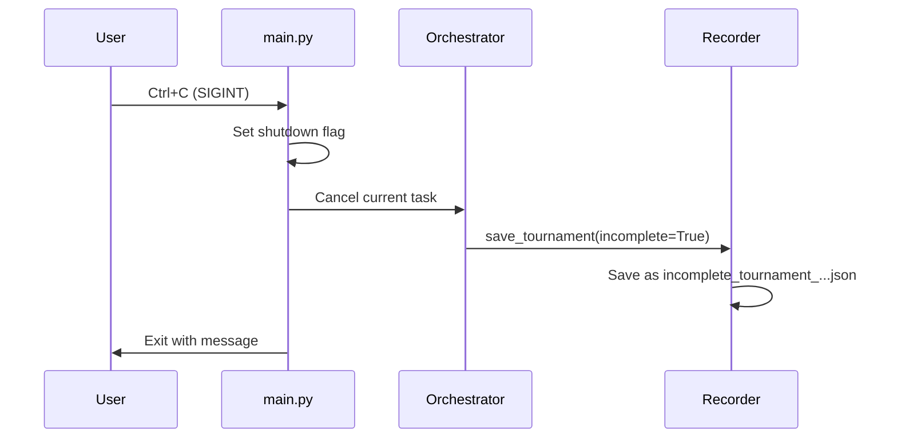

# Graceful Shutdown for Tournament Runner

## Overview

When Ctrl+C is pressed, the application should:

1. Cancel ongoing async tasks gracefully
2. Save any recorded tournament data with "incomplete_" prefix
3. Exit cleanly

## Changes Required

### 1. Modify GameStateRecorder

Update [`backend/domain/game/recorder.py`](app/backend/domain/game/recorder.py):

- Add `incomplete` parameter to `save_tournament()` method
- When `incomplete=True`, prefix filename with "incomplete_"

### 2. Modify TournamentOrchestrator

Update [`backend/domain/tournament/orchestrator.py`](app/backend/domain/tournament/orchestrator.py):

- Add `save_incomplete()` method to save current state when interrupted
- Expose the recorder for external access during shutdown

### 3. Add Signal Handling in main.py

Update [`backend/main.py`](app/backend/main.py):

- Register SIGINT handler using `signal` module
- On interrupt: cancel running tasks and trigger incomplete save
- Use a shutdown flag to coordinate graceful exit

## File Changes

| File | Change |

|------|--------|

| `backend/domain/game/recorder.py` | Add `incomplete` param to `save_tournament()` |

| `backend/domain/tournament/orchestrator.py` | Add `save_incomplete()` method |

| `backend/main.py` | Add SIGINT handler and graceful shutdown logic |

