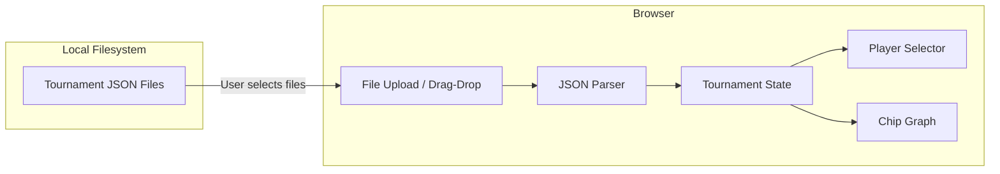

# React Chip Graph Frontend

## Architecture

## Data Flow

The graph will show chip progression across tournaments using `tournament_details[].final_stacks`:

- X-axis: Tournament number (1, 2, 3...)
- Y-axis: Chip count
- One line per selected player

User workflow:

1. Drag-drop or select JSON tournament files from their filesystem
2. App parses files and extracts tournament data
3. Select players to visualize
4. View chip progression graph

## Implementation

### React Frontend (Client-Side Only)

Create [app/frontend/](app/frontend/) with Vite + React (JavaScript):

**Components**:

- `FileUploader`: Drag-drop zone + file input for selecting tournament JSONs
- `PlayerSelector`: Checkboxes to select which players to display
- `ChipGraph`: Line chart showing chip changes per tournament

**Libraries**:

- Recharts for the line graph
- CSS modules or inline styles for styling (dark theme)

**No backend required** - all processing happens in the browser.

## Key Files

| File | Purpose |

|------|---------|

| `app/frontend/src/App.jsx` | Main app with file upload and state management |

| `app/frontend/src/components/FileUploader.jsx` | Drag-drop file upload component |

| `app/frontend/src/components/PlayerSelector.jsx` | Player selection checkboxes |

| `app/frontend/src/components/ChipGraph.jsx` | Recharts line chart component |

| `app/frontend/src/App.css` | Dark theme styles |